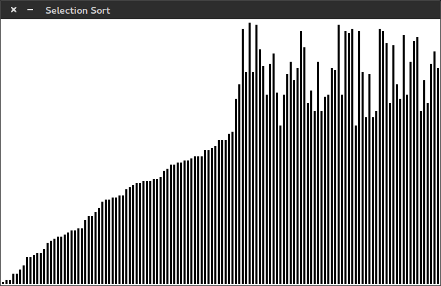
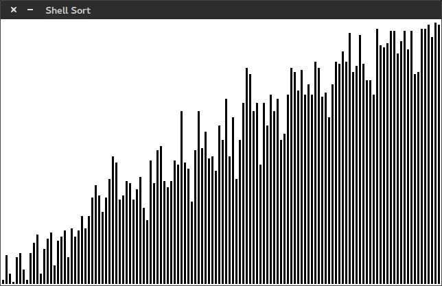

# visual-algorithms
Implementations of various sorting algorithms in C and visualization with SDL 2. 
See my [c-algorithms repo](https://github.com/Grayson112233/c-algorithms) for more
information on the algorithms.

### Building and Running
Install the only dependency: `libsdl2-dev` (`sudo apt-get install libsdl2-dev`).

Makefiles exist for each algorithm, so run `make <target>` to create an executable.

### Implemented Algorithms So Far:

*  Selection Sort
*  Insertion Sort
*  Shell Sort

